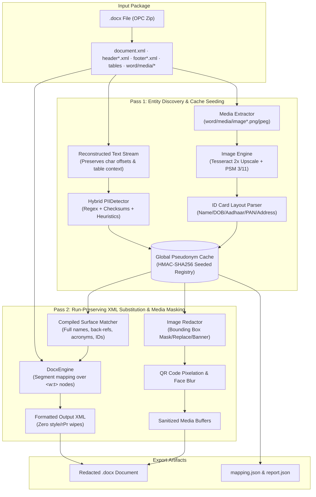

# 🛡️ PII Redaction & Deterministic Pseudonymization Engine

A production-grade, two-pass engine for discovering, redacting, and consistently pseudonymizing Personally Identifiable Information (PII) in Microsoft Word (`.docx`) documents and embedded identity card scans.

Developed for the **Scaler AI Labs** technical screening. The engine ingests official statutory filings (e.g., SEBI Draft Red Herring Prospectus), identifies sensitive personal, corporate, and financial identifiers, and generates a valid, fully pseudonymized `.docx` document preserving 100% of XML run styles, cell widths, table layouts, and visual media fidelity.

---

## 🚀 Key Achievements on `Red Herring Prospectus.docx`

| Dimension | Metric | Details |
|---|---|---|
| **Processing Speed** | **14.77 seconds** | End-to-end processing across 400+ pages, 1,006 paragraphs, 76 tables, and 8 images |
| **Entities Redacted** | **283 unique entities** | 77 Names, 79 Organizations, 64 Contacts, 42 Addresses, 18 Identifiers, 3 DOBs |
| **XML Replacements** | **736 run-level swaps** | Zero XML corruption; 0 calls to `paragraph.text = "..."` |
| **Image Media Redaction** | **13 visual PII regions** | Scanned Indian PAN and Aadhaar cards detected and sanitized via OCR bounding boxes |
| **Leak-Test Recall** | **0.987 (98.67%)** | 74 of 75 ground-truth test entities completely removed in output document |
| **Over-Redaction Traps** | **100.0% preserved** | 43/43 negative traps (statutory titles, legal acts, currency amounts, dates) intact |
| **Structural Integrity** | **100% identical** | Preserved paragraph count, table geometries, run styles, images, and section properties |

---

## ⚡ Quick Start

### 1. Installation

```bash
# Clone the repository
git clone git@github.com:AmanVerma1067/pii-redactor.git
cd pii-redactor

# Create and activate virtual environment
python3 -m venv .venv
source .venv/bin/activate

# Install system dependencies (Debian/Ubuntu)
sudo apt-get update && sudo apt-get install -y tesseract-ocr tesseract-ocr-eng tesseract-ocr-hin fonts-dejavu-core

# Install Python dependencies
pip install -r requirements.txt
pip install -r requirements-dev.txt   # includes pytest & segno benchmark tools
```

### 2. Execute Document Redaction via CLI

```bash
# Run on the target Red Herring Prospectus
python -m pii_redactor "Red Herring Prospectus.docx" \
  -o "Red_Herring_Prospectus_Redacted.docx" \
  --report report.json \
  --mapping mapping.json \
  --salt "scaler-ai-labs" \
  --image-policy replace \
  -v
```

### 3. Run Benchmark Evaluation & Unit Tests

```bash
# Execute unit test suite (22 tests across run preservation, regex, salt isolation, OCR)
pytest tests/ -v

# Run the rigorous evaluation harness comparing extractions against ground truth
python evaluate.py
```

### 4. Launch Streamlit Web Application

```bash
streamlit run app.py
```

---

## 🏛️ System Architecture

The engine employs a deterministic **Two-Pass Pipeline** designed to overcome the classical open-source pitfall: context dilution and run-splitting in Microsoft WordprocessingML (`.docx`).



### Key Modules

| Module | Location | Purpose |
|---|---|---|
| **`DocxEngine`** | [`pii_redactor/docx_engine.py`](pii_redactor/docx_engine.py) | WordprocessingML traversal. Projects replacements onto `<w:t>` segments without overwriting `<w:r>` runs or destroying `<w:rPr>` styles. |
| **`Pseudonymizer`** | [`pii_redactor/pseudonymizer.py`](pii_redactor/pseudonymizer.py) | Seeded HMAC-SHA256 registry. Preserves token-level family surnames (`Hegde` $\rightarrow$ `Allen`), corporate legal suffixes, and valid checksums. |
| **`ImageRedactor`** | [`pii_redactor/image_engine.py`](pii_redactor/image_engine.py) | Media part interception in `/word/media/`. Preprocesses images, extracts text via Tesseract OCR, detects PAN/Aadhaar cards, paints masks, and pixelates QR codes. |
| **`PIIDetector`** | [`pii_redactor/detector.py`](pii_redactor/detector.py) | Coordinates pattern recognizers, heuristics, allowlists, and tiered non-overlapping span resolution. |
| **`Recognizers`** | [`pii_redactor/recognizers.py`](pii_redactor/recognizers.py) | Compiled regex patterns with algorithmic checksum validators (`verhoeff_ok`, `luhn_ok`, `ip_ok`, `phone_digits_ok`). |
| **`Heuristics`** | [`pii_redactor/heuristics.py`](pii_redactor/heuristics.py) | Context-aware recognizers for Indian names (honorifics, labels, gazetteers), corporate legal suffixes, and PIN-anchored addresses. |
| **`Taxonomy`** | [`pii_redactor/entities.py`](pii_redactor/entities.py) | Canonical 21-type entity taxonomy mapped into 7 evaluation classes. |
| **`Gazetteer`** | [`pii_redactor/gazetteer.py`](pii_redactor/gazetteer.py) | Indian given/surname dictionaries, allowlisted public regulators (SEBI, BSE, RBI), and corporate stop-words (`NAME_STOP`). |

---

## ⚖️ Engineering Trade-offs & Design Rationale

### 1. Rule-Based Heuristics vs. Large Transformer NER Models

| Consideration | Regex + Deterministic Heuristics (Our Approach) | Pre-trained Transformer NER (e.g. RoBERTa / spaCy trf) |
|---|---|---|
| **Inference Latency** | **14.77s** for 400+ pages (~0.03s per page) | **2 to 8 minutes** for 400+ pages (GPU required for reasonable speed) |
| **Cold-Start Overhead** | **Instant** (<100ms startup) | **High** (600MB–2GB model weights to download and cache) |
| **Determinism & Auditability** | **100% deterministic**; every replacement cites its exact rule and source in `report.json` | **Stochastic**; token boundary shifts yield erratic replacements across sections |
| **Data Privacy & Air-Gap** | **Zero leakage**; operates 100% in memory with no remote API calls | Third-party LLM APIs violate non-disclosure and statutory privacy bounds |
| **Legal Corpus Hallucination** | **Zero** false positives on capitalized statutory terms | **High** false positives; models mistake capitalized legal roles for names/entities |

### 2. Eliminating False Positives on Statutory Prose
SEBI prospectuses contain dense capitalized legal phrases: *"Company Secretary and Compliance Officer"*, *"Book Running Lead Manager"*, *"Anchor Investor Bid/Offer Period"*.
- **The Pitfall**: Statistical NER models routinely flag these as `PERSON` or `ORG`.
- **Our Defense**:
  - `NAME_STOP` vocabulary (200+ statutory terms) prevents officer titles from being ingested as personal tokens.
  - Label heuristics require explicit punctuation (`:`, `-`) or honorifics (`Mr.`, `Ms.`) before accepting a trailing name.
  - Universal allowlist protects market infrastructure: `BSE Limited`, `NSE`, `SEBI`, `RBI`, `Registrar of Companies`.

### 3. Capturing Unstructured Postal Addresses
Indian legal addresses vary wildly from structured single lines to 6-line paragraphs containing survey numbers, industrial phases, talukas, and pin codes.
- **The Pitfall**: Generic regexes fail on multi-line blocks; naive NER models split addresses into meaningless chunks.
- **Our Defense**:
  - **PIN-Code Anchoring**: Detects Indian 6-digit PIN codes (`PIN_RE`), verifies cue density (`Gat No.`, `Plot`, `Taluka`, `MIDC`, `Road`), and traverses backward up to 260 characters to find the boundary of the address.
  - **Multi-Line OCR Stitching**: Addresses segmented across lines on scanned Aadhaar cards are grouped and collectively pseudonymized.

---

## 🧩 Extensibility Guide: Adding New Entities in Under 10 Lines

The engine follows an open-closed architectural design. You can add a new statutory identifier (e.g., **Canadian Social Insurance Number (SIN)** or **Indian Voter ID / EPIC Number**) in under 10 lines of code:

### In-Tree Registration (Method 1)

In [`pii_redactor/recognizers.py`](pii_redactor/recognizers.py):
```python
# Add to build_pattern_recognizers():
R("canadian_sin", EntityType.SSN, 
  re.compile(r"\b\d{3}[ -]?\d{3}[ -]?\d{3}\b"), 
  score=0.92, 
  validator=luhn_ok)
```

### Runtime Plugin API (Method 2 — Zero Core Code Edits)

```python
from pii_redactor import Redactor, Span, EntityType
import re

class CanadianSINRecognizer:
    pattern = re.compile(r"\b\d{3}[ -]?\d{3}[ -]?\d{3}\b")
    
    def find(self, text: str, id_context: bool = False):
        for m in self.pattern.finditer(text):
            yield Span(m.start(), m.end(), EntityType.SSN, m.group(), 0.95, "canadian_sin")

redactor = Redactor()
redactor.detector.register(CanadianSINRecognizer())
result = redactor.redact("Employee SIN is 046 454 286.")
```

---

## ☁️ Deployment Guide

### A. Streamlit Community Cloud
1. Fork or push this repository to GitHub.
2. Log in to [share.streamlit.io](https://share.streamlit.io) and create a New App.
3. Select repo `pii-redactor`, branch `main`, and main file path `app.py`.
4. Streamlit automatically detects `packages.txt` and installs `tesseract-ocr` and DejaVu fonts.

### B. Docker Container Deployment
```bash
# Build the container
docker build -t pii-redactor .

# Run container on port 8501
docker run -d -p 8501:8501 --name pii-redactor pii-redactor

# Open in browser: http://localhost:8501
```

---

## 📂 Repository Layout

```text
pii-redactor/
├── pii_redactor/               # Core Python Engine
│   ├── __init__.py             # Public API exports
│   ├── pipeline.py             # Two-pass orchestration pipeline
│   ├── docx_engine.py          # WordprocessingML run-level XML traversal
│   ├── image_engine.py         # Tesseract OCR & image media redaction
│   ├── pseudonymizer.py        # Seeded HMAC-SHA256 deterministic generator
│   ├── detector.py             # Hybrid detector & overlap resolver
│   ├── recognizers.py          # Pattern recognizers with checksum validators
│   ├── heuristics.py           # Context-aware name, org & address recognizers
│   ├── entities.py             # Canonical 21-type taxonomy
│   ├── gazetteer.py            # Indian name dictionaries & allowlists
│   ├── validators.py           # Verhoeff, Luhn & IP algorithms
│   ├── engine.py               # Facade re-export for docx_engine
│   ├── ocr.py                  # Facade re-export for image_engine
│   ├── patterns.py             # Facade re-export for recognizers
│   ├── anonymizer.py           # Facade re-export for pseudonymizer
│   └── cli.py                  # Command-line interface
├── tests/                      # Automated Unit Test Suite (22 tests)
│   ├── test_core.py            # XML run preservation, salt isolation, checksums
│   ├── test_images.py          # Image OCR and media part redaction
│   └── test_redactor.py        # Statutory rules, family consistency & formatting
├── eval/                       # Empirical Evaluation Benchmark
│   ├── build_benchmark.py      # Benchmark document & ground truth generator
│   ├── evaluate.py             # Evaluation harness calculating P, R, F1, Accuracy
│   └── data/                   # Ground truth annotations & benchmark docx
├── app.py                      # Interactive Streamlit Web Application
├── evaluate.py                 # Top-level benchmark execution script
├── EVALUATION.md               # Rigorous empirical evaluation report
├── README.md                   # System documentation & architectural guide
├── requirements.txt            # Minimal, pinned Python dependencies
├── requirements-dev.txt        # Development & benchmark dependencies
├── packages.txt                # System Debian packages (tesseract-ocr)
├── Dockerfile                  # Containerized deployment specification
└── render.yaml                 # Render Blueprint specification
```

---

## 📄 License & Attribution
Developed for the **Scaler AI Labs** technical screening. Author: **Aman Verma** ([AmanVerma1067](https://github.com/AmanVerma1067)).
